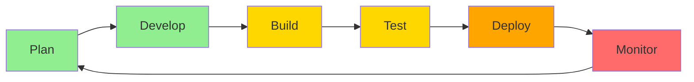

## Welcome to DevSecForge

DevSecForge is your complete guide to DevSecOps practices, tools, and workflows. This documentation covers security, development, infrastructure, and CI/CD best practices.

## What is DevSecOps?

DevSecOps integrates security practices into every phase of the software development lifecycle, from planning to deployment and monitoring.



## Quick Navigation

<Cards>
  <Card title="Security" href="/docs/02-security" icon="Shield">
    SAST, DAST, SCA, secrets management, and security best practices
  </Card>
  <Card title="Development" href="/docs/03-development" icon="Code">
    Code quality, testing, version control, and code reviews
  </Card>
  <Card title="Infrastructure" href="/docs/04-infrastructure" icon="Server">
    Docker, Kubernetes, and Infrastructure as Code
  </Card>
  <Card title="CI/CD" href="/docs/05-cicd" icon="GitBranch">
    Pipeline design, automation, and deployment strategies
  </Card>
</Cards>

## Learning Paths

### 🔰 Beginner Path

<Steps>
  <Step>Start with [Security Basics](/docs/02-security)</Step>
  <Step>Learn [Version Control](/docs/03-development/git-workflows/version-control)</Step>
  <Step>Understand [Docker Basics](/docs/04-infrastructure/containerization/docker)</Step>
  <Step>Build your first [CI/CD Pipeline](/docs/05-cicd/pipelines/getting-started)</Step>
</Steps>

### 🚀 Advanced Path

<Steps>
  <Step>Master [SAST Implementation](/docs/02-security/scanning/sast)</Step>
  <Step>Implement [Kubernetes Security](/docs/04-infrastructure/orchestration/kubernetes-security)</Step>
  <Step>Build [Advanced Pipelines](/docs/05-cicd/pipelines/advanced)</Step>
  <Step>Deploy with [GitOps](/docs/05-cicd/deployment/gitops)</Step>
</Steps>

## Key Principles

### 1. **Security First**
Integrate security from the start, not as an afterthought.

### 2. **Automate Everything**
Automation reduces errors and increases speed.

### 3. **Continuous Improvement**
Iterate, measure, and optimize continuously.

### 4. **Collaboration**
Break down silos between teams.

### 5. **Infrastructure as Code**
Manage infrastructure through version-controlled code.

## Documentation Structure

```
📁 content/docs/
├── 📁 01-getting-started/     # You are here
├── 📁 02-security/            # Security practices & tools
│   ├── 📁 scanning/           # SAST, DAST, SCA
│   ├── 📁 secrets-management/ # Secrets & credentials
│   └── 📁 best-practices/     # Security guidelines
├── 📁 03-development/         # Development workflows
│   ├── 📁 code-quality/       # Linting, formatting
│   ├── 📁 testing/            # Testing strategies
│   └── 📁 git-workflows/      # Git & code review
├── 📁 04-infrastructure/      # Infrastructure management
│   ├── 📁 containerization/   # Docker & containers
│   ├── 📁 orchestration/      # Kubernetes
│   └── 📁 iac/                # Terraform, Ansible
└── 📁 05-cicd/                # CI/CD pipelines
    ├── 📁 pipelines/          # Pipeline design
    ├── 📁 platforms/          # GitHub Actions, GitLab
    └── 📁 deployment/         # Deployment strategies
```

## Tools & Technologies

### Security
- **SAST**: Semgrep, SonarQube, Checkmarx
- **DAST**: OWASP ZAP, Burp Suite, Nuclei
- **SCA**: Snyk, Dependabot, OWASP Dependency-Check
- **Secrets**: HashiCorp Vault, AWS Secrets Manager

### Development
- **Version Control**: Git, GitHub, GitLab
- **Testing**: Jest, Pytest, JUnit, Playwright
- **Quality**: ESLint, Prettier, SonarQube

### Infrastructure
- **Containers**: Docker, Podman
- **Orchestration**: Kubernetes, Docker Swarm
- **IaC**: Terraform, Ansible, Pulumi
- **Cloud**: AWS, Azure, GCP

### CI/CD
- **Platforms**: GitHub Actions, GitLab CI, Jenkins
- **Deployment**: ArgoCD, Flux, Spinnaker
- **Monitoring**: Prometheus, Grafana, ELK Stack

## Getting Help

<Callout type="info">
- 💬 **Questions?** Check the specific section's documentation
- 🐛 **Found an issue?** Report it on GitHub
- 💡 **Have suggestions?** Contribute to the docs
- 📧 **Need support?** Contact the team
</Callout>

## Next Steps

Choose your path based on your role and goals:

<Tabs items={['Developer', 'Security Engineer', 'DevOps Engineer', 'Team Lead']}>
  <Tab value="Developer">
    1. [Code Quality](/docs/03-development/code-quality)
    2. [Testing Practices](/docs/03-development/testing)
    3. [Git Workflows](/docs/03-development/git-workflows/version-control)
    4. [SAST Integration](/docs/02-security/scanning/sast)
  </Tab>
  <Tab value="Security Engineer">
    1. [Security Overview](/docs/02-security)
    2. [SAST](/docs/02-security/scanning/sast)
    3. [DAST](/docs/02-security/scanning/dast)
    4. [Container Security](/docs/02-security/best-practices/container-security)
  </Tab>
  <Tab value="DevOps Engineer">
    1. [Infrastructure Overview](/docs/04-infrastructure)
    2. [Docker](/docs/04-infrastructure/containerization/docker)
    3. [Kubernetes](/docs/04-infrastructure/orchestration/kubernetes)
    4. [CI/CD Pipelines](/docs/05-cicd/pipelines)
  </Tab>
  <Tab value="Team Lead">
    1. [Security Best Practices](/docs/02-security/best-practices/overview)
    2. [Code Review Guidelines](/docs/03-development/git-workflows/code-review)
    3. [Infrastructure Strategy](/docs/04-infrastructure)
    4. [Deployment Strategies](/docs/05-cicd/deployment)
  </Tab>
</Tabs>

## Contributing

We welcome contributions! Help us improve this documentation by:

- Reporting issues and suggesting improvements
- Adding examples and use cases
- Updating outdated information
- Creating new guides and tutorials

---

**Ready to dive in?** Start with [Security](/docs/02-security) or explore any topic from the navigation menu.
