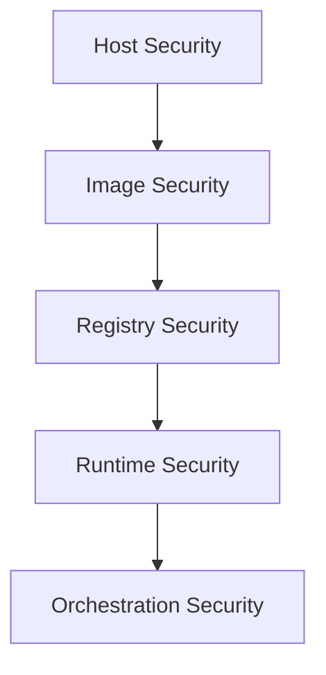

## Container Security Overview

Container security involves protecting containerized applications throughout their lifecycle: build, ship, and run.

## Container Security Layers



## Image Scanning Tools

### Trivy

**Fast, comprehensive vulnerability scanner**

```package-install
aquasecurity/trivy
```

```bash
# Scan Docker image
trivy image nginx:latest

# Scan with specific severities
trivy image --severity HIGH,CRITICAL nginx:latest

# Generate report
trivy image --format json -o report.json myapp:latest

# Scan filesystem
trivy fs --security-checks vuln,config ./

# Scan Kubernetes
trivy k8s --report summary cluster
```

### Grype (Anchore)

```bash
# Install
curl -sSfL https://raw.githubusercontent.com/anchore/grype/main/install.sh | sh

# Scan image
grype docker:nginx:latest

# Scan local directory
grype dir:.

# Output formats
grype -o json myapp:latest
grype -o table myapp:latest
```

### Clair

```yaml
# docker-compose.yml for Clair
version: '3'
services:
  postgres:
    image: postgres:latest
    environment:
      POSTGRES_PASSWORD: password
    
  clair:
    image: quay.io/coreos/clair:latest
    ports:
      - "6060:6060"
      - "6061:6061"
    depends_on:
      - postgres
```

## CI/CD Integration

### GitHub Actions

```yaml
name: Container Security

on:
  push:
    branches: [main]
  pull_request:
    branches: [main]

jobs:
  scan:
    runs-on: ubuntu-latest
    steps:
      - uses: actions/checkout@v4
      
      - name: Build image
        run: docker build -t myapp:${{ github.sha }} .
      
      - name: Run Trivy vulnerability scanner
        uses: aquasecurity/trivy-action@master
        with:
          image-ref: 'myapp:${{ github.sha }}'
          format: 'sarif'
          output: 'trivy-results.sarif'
          severity: 'CRITICAL,HIGH'
      
      - name: Upload Trivy results to GitHub Security
        uses: github/codeql-action/upload-sarif@v3
        with:
          sarif_file: 'trivy-results.sarif'
      
      - name: Fail on high vulnerabilities
        uses: aquasecurity/trivy-action@master
        with:
          image-ref: 'myapp:${{ github.sha }}'
          exit-code: '1'
          severity: 'CRITICAL,HIGH'
```

### GitLab CI

```yaml
container_scanning:
  stage: security
  image: docker:stable
  services:
    - docker:dind
  script:
    - docker build -t $CI_REGISTRY_IMAGE:$CI_COMMIT_SHA .
    - |
      docker run --rm \
        -v /var/run/docker.sock:/var/run/docker.sock \
        aquasec/trivy image \
        --exit-code 1 \
        --severity HIGH,CRITICAL \
        $CI_REGISTRY_IMAGE:$CI_COMMIT_SHA
  only:
    - branches
```

### Jenkins Pipeline

```groovy
pipeline {
    agent any
    
    stages {
        stage('Build') {
            steps {
                sh 'docker build -t myapp:${BUILD_NUMBER} .'
            }
        }
        
        stage('Security Scan') {
            steps {
                sh '''
                    docker run --rm \
                      -v /var/run/docker.sock:/var/run/docker.sock \
                      aquasec/trivy image \
                      --format json \
                      --output trivy-report.json \
                      myapp:${BUILD_NUMBER}
                '''
                
                publishHTML([
                    reportDir: '.',
                    reportFiles: 'trivy-report.json',
                    reportName: 'Trivy Security Report'
                ])
            }
        }
    }
}
```

## Dockerfile Best Practices

### Secure Dockerfile Example

```dockerfile
# Use specific version (not latest)
FROM node:20.10.0-alpine3.19 AS builder

# Create non-root user
RUN addgroup -g 1001 -S nodejs && \
    adduser -S nodejs -u 1001

# Set working directory
WORKDIR /app

# Copy dependency files
COPY package*.json ./

# Install dependencies
RUN npm ci --only=production && \
    npm cache clean --force

# Copy application code
COPY --chown=nodejs:nodejs . .

# Build application
RUN npm run build

# Production image
FROM node:20.10.0-alpine3.19

# Install dumb-init for proper signal handling
RUN apk add --no-cache dumb-init

# Create non-root user
RUN addgroup -g 1001 -S nodejs && \
    adduser -S nodejs -u 1001

# Set working directory
WORKDIR /app

# Copy from builder
COPY --from=builder --chown=nodejs:nodejs /app/dist ./dist
COPY --from=builder --chown=nodejs:nodejs /app/node_modules ./node_modules
COPY --from=builder --chown=nodejs:nodejs /app/package*.json ./

# Switch to non-root user
USER nodejs

# Expose port
EXPOSE 3000

# Use dumb-init
ENTRYPOINT ["dumb-init", "--"]

# Run application
CMD ["node", "dist/index.js"]

# Health check
HEALTHCHECK --interval=30s --timeout=3s --start-period=5s --retries=3 \
  CMD node healthcheck.js
```

### Security Checklist

<Callout type="info">
✅ **Do:**
- Use official base images
- Pin specific versions
- Use multi-stage builds
- Run as non-root user
- Scan for vulnerabilities
- Keep images small
- Remove unnecessary packages
- Use .dockerignore
- Sign images

❌ **Don't:**
- Use `latest` tag
- Run as root
- Store secrets in images
- Install unnecessary packages
- Use deprecated images
- Expose sensitive ports
</Callout>

## Runtime Security

### Docker Security Options

```bash
# Run with security options
docker run -d \
  --name myapp \
  --read-only \
  --security-opt=no-new-privileges:true \
  --cap-drop=ALL \
  --cap-add=NET_BIND_SERVICE \
  --user 1000:1000 \
  myapp:latest
```

### AppArmor Profile

```bash
# Load AppArmor profile
sudo apparmor_parser -r -W /etc/apparmor.d/docker-default

# Run with AppArmor
docker run --security-opt apparmor=docker-default myapp:latest
```

### Seccomp Profile

```json
{
  "defaultAction": "SCMP_ACT_ERRNO",
  "architectures": [
    "SCMP_ARCH_X86_64"
  ],
  "syscalls": [
    {
      "names": [
        "read",
        "write",
        "exit",
        "exit_group"
      ],
      "action": "SCMP_ACT_ALLOW"
    }
  ]
}
```

```bash
# Run with seccomp profile
docker run --security-opt seccomp=profile.json myapp:latest
```

## Image Signing and Verification

### Docker Content Trust

```bash
# Enable Docker Content Trust
export DOCKER_CONTENT_TRUST=1

# Push signed image
docker push myrepo/myapp:v1.0

# Pull and verify
docker pull myrepo/myapp:v1.0
```

### Cosign (Sigstore)

```bash
# Install cosign
brew install cosign

# Generate key pair
cosign generate-key-pair

# Sign image
cosign sign --key cosign.key myrepo/myapp:v1.0

# Verify signature
cosign verify --key cosign.pub myrepo/myapp:v1.0
```

### Notary

```bash
# Initialize notary
notary init docker.io/myrepo/myapp

# Add signature
notary add docker.io/myrepo/myapp v1.0 myapp-v1.0.tar.gz

# Verify
notary list docker.io/myrepo/myapp
```

## Registry Security

### Harbor Registry

```yaml
# docker-compose.yml for Harbor
version: '3'
services:
  registry:
    image: goharbor/harbor-registryctl:v2.9.0
    environment:
      - HARBOR_ADMIN_PASSWORD=Harbor12345
    ports:
      - "80:8080"
    volumes:
      - harbor_data:/data
      
volumes:
  harbor_data:
```

**Features:**
- Vulnerability scanning
- Image signing
- RBAC
- Replication
- Quota management

### Private Registry Security

```bash
# Create registry with authentication
docker run -d \
  -p 5000:5000 \
  --restart=always \
  --name registry \
  -v /path/to/auth:/auth \
  -e "REGISTRY_AUTH=htpasswd" \
  -e "REGISTRY_AUTH_HTPASSWD_REALM=Registry Realm" \
  -e "REGISTRY_AUTH_HTPASSWD_PATH=/auth/htpasswd" \
  -v /path/to/certs:/certs \
  -e REGISTRY_HTTP_TLS_CERTIFICATE=/certs/domain.crt \
  -e REGISTRY_HTTP_TLS_KEY=/certs/domain.key \
  registry:2
```

## Kubernetes Container Security

### Pod Security Standards

```yaml
apiVersion: v1
kind: Namespace
metadata:
  name: production
  labels:
    pod-security.kubernetes.io/enforce: restricted
    pod-security.kubernetes.io/audit: restricted
    pod-security.kubernetes.io/warn: restricted
```

### Security Context

```yaml
apiVersion: v1
kind: Pod
metadata:
  name: secure-pod
spec:
  securityContext:
    runAsNonRoot: true
    runAsUser: 1000
    fsGroup: 1000
    seccompProfile:
      type: RuntimeDefault
  
  containers:
  - name: app
    image: myapp:latest
    securityContext:
      allowPrivilegeEscalation: false
      readOnlyRootFilesystem: true
      runAsNonRoot: true
      runAsUser: 1000
      capabilities:
        drop:
          - ALL
        add:
          - NET_BIND_SERVICE
    
    volumeMounts:
    - name: tmp
      mountPath: /tmp
    - name: cache
      mountPath: /app/cache
  
  volumes:
  - name: tmp
    emptyDir: {}
  - name: cache
    emptyDir: {}
```

### Network Policies

```yaml
apiVersion: networking.k8s.io/v1
kind: NetworkPolicy
metadata:
  name: app-network-policy
spec:
  podSelector:
    matchLabels:
      app: myapp
  policyTypes:
  - Ingress
  - Egress
  ingress:
  - from:
    - podSelector:
        matchLabels:
          app: frontend
    ports:
    - protocol: TCP
      port: 3000
  egress:
  - to:
    - podSelector:
        matchLabels:
          app: database
    ports:
    - protocol: TCP
      port: 5432
```

## Runtime Monitoring

### Falco

```yaml
# Install Falco
apiVersion: v1
kind: ConfigMap
metadata:
  name: falco-config
data:
  falco.yaml: |
    rules_file:
      - /etc/falco/falco_rules.yaml
      - /etc/falco/falco_rules.local.yaml
    json_output: true
    log_level: info
```

**Sample Rules:**

```yaml
- rule: Terminal Shell in Container
  desc: A shell was spawned in a container
  condition: >
    spawned_process and container and
    shell_procs and proc.tty != 0
  output: >
    Shell spawned in container
    (user=%user.name container_id=%container.id
    container_name=%container.name shell=%proc.name)
  priority: WARNING
```

## Compliance and Standards

### CIS Benchmarks

```bash
# Docker Bench Security
git clone https://github.com/docker/docker-bench-security.git
cd docker-bench-security
sudo sh docker-bench-security.sh
```

### OpenSCAP

```bash
# Scan image with OpenSCAP
oscap-docker image nginx:latest xccdf eval \
  --profile standard \
  --results results.xml \
  /usr/share/xml/scap/security-guide.xml
```

## Best Practices Summary

<Steps>
  <Step>**Build**: Use minimal base images, scan for vulnerabilities</Step>
  <Step>**Ship**: Sign images, use private registries, implement RBAC</Step>
  <Step>**Run**: Apply runtime security, use security contexts, monitor</Step>
  <Step>**Monitor**: Continuous scanning, runtime detection, audit logs</Step>
  <Step>**Update**: Regular patching, automated updates, version control</Step>
</Steps>

## Next Steps

<Cards>
  <Card title="Kubernetes Security" href="/docs/infrastructure/kubernetes-security" />
  <Card title="CI/CD Security" href="/docs/cicd/security" />
  <Card title="Security Best Practices" href="/docs/security/best-practices" />
</Cards>
