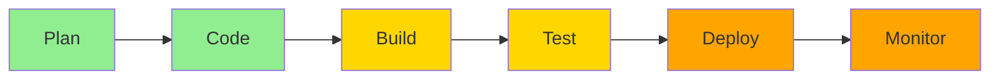

## Security Fundamentals

Security is everyone's responsibility. These best practices help build secure applications from the ground up.

## Shift-Left Security



<Callout type="info">
**Shift-Left** means integrating security earlier in the SDLC, making it cheaper and faster to fix issues.
</Callout>

## Secure Coding Practices

### Input Validation

```python
# ❌ Bad: No validation
def get_user(user_id):
    query = f"SELECT * FROM users WHERE id = {user_id}"
    return db.execute(query)

# ✅ Good: Parameterized queries
def get_user(user_id):
    if not isinstance(user_id, int):
        raise ValueError("Invalid user ID")
    query = "SELECT * FROM users WHERE id = ?"
    return db.execute(query, (user_id,))
```

### Output Encoding

```javascript
// ❌ Bad: Direct DOM manipulation
document.getElementById('user').innerHTML = userInput;

// ✅ Good: Escape HTML
function escapeHtml(unsafe) {
    return unsafe
        .replace(/&/g, "&amp;")
        .replace(/</g, "&lt;")
        .replace(/>/g, "&gt;")
        .replace(/"/g, "&quot;")
        .replace(/'/g, "&#039;");
}
document.getElementById('user').textContent = escapeHtml(userInput);
```

### Authentication

```typescript
// ✅ Good: Secure password hashing
import bcrypt from 'bcrypt';

async function hashPassword(password: string): Promise<string> {
    const saltRounds = 12;
    return await bcrypt.hash(password, saltRounds);
}

async function verifyPassword(
    password: string,
    hash: string
): Promise<boolean> {
    return await bcrypt.compare(password, hash);
}

// ✅ Good: JWT with expiration
import jwt from 'jsonwebtoken';

function generateToken(userId: string): string {
    return jwt.sign(
        { userId },
        process.env.JWT_SECRET!,
        { expiresIn: '1h' }
    );
}
```

### Authorization

```python
# ✅ Good: Role-based access control
from functools import wraps
from flask import abort, g

def requires_role(role):
    def decorator(f):
        @wraps(f)
        def decorated_function(*args, **kwargs):
            if not g.user:
                abort(401)
            if role not in g.user.roles:
                abort(403)
            return f(*args, **kwargs)
        return decorated_function
    return decorator

@app.route('/admin')
@requires_role('admin')
def admin_panel():
    return "Admin Dashboard"
```

## OWASP Top 10 (2021)

### A01: Broken Access Control

```python
# ❌ Bad: No access control
@app.route('/user/<user_id>')
def get_user(user_id):
    return User.query.get(user_id)

# ✅ Good: Verify ownership
@app.route('/user/<user_id>')
@login_required
def get_user(user_id):
    user = User.query.get(user_id)
    if user.id != current_user.id and not current_user.is_admin:
        abort(403)
    return user
```

### A02: Cryptographic Failures

```javascript
// ✅ Good: Encrypt sensitive data
const crypto = require('crypto');

function encrypt(text, key) {
    const iv = crypto.randomBytes(16);
    const cipher = crypto.createCipheriv('aes-256-gcm', key, iv);
    
    let encrypted = cipher.update(text, 'utf8', 'hex');
    encrypted += cipher.final('hex');
    
    const authTag = cipher.getAuthTag();
    
    return {
        encrypted,
        iv: iv.toString('hex'),
        authTag: authTag.toString('hex')
    };
}
```

### A03: Injection

```java
// ✅ Good: Use prepared statements
public User getUserById(int userId) {
    String sql = "SELECT * FROM users WHERE id = ?";
    try (PreparedStatement stmt = connection.prepareStatement(sql)) {
        stmt.setInt(1, userId);
        ResultSet rs = stmt.executeQuery();
        // Process results
    }
}
```

### A04: Insecure Design

```yaml
# ✅ Good: Rate limiting
apiVersion: networking.k8s.io/v1
kind: Ingress
metadata:
  name: app-ingress
  annotations:
    nginx.ingress.kubernetes.io/limit-rps: "10"
    nginx.ingress.kubernetes.io/limit-burst-multiplier: "5"
```

### A05: Security Misconfiguration

```nginx
# ✅ Good: Secure headers
add_header X-Frame-Options "SAMEORIGIN" always;
add_header X-Content-Type-Options "nosniff" always;
add_header X-XSS-Protection "1; mode=block" always;
add_header Strict-Transport-Security "max-age=31536000; includeSubDomains" always;
add_header Content-Security-Policy "default-src 'self'" always;
add_header Referrer-Policy "strict-origin-when-cross-origin" always;
```

### A06: Vulnerable Components

```yaml
# ✅ Good: Automated dependency updates
# .github/dependabot.yml
version: 2
updates:
  - package-ecosystem: "npm"
    directory: "/"
    schedule:
      interval: "daily"
    open-pull-requests-limit: 10
```

### A07: Authentication Failures

```python
# ✅ Good: Multi-factor authentication
from pyotp import TOTP

def verify_2fa(user, token):
    totp = TOTP(user.totp_secret)
    return totp.verify(token, valid_window=1)

# ✅ Good: Account lockout
MAX_LOGIN_ATTEMPTS = 5
LOCKOUT_DURATION = 900  # 15 minutes

def check_login_attempts(user):
    if user.failed_attempts >= MAX_LOGIN_ATTEMPTS:
        if (datetime.now() - user.last_failed_login).seconds < LOCKOUT_DURATION:
            raise AccountLockedError()
        else:
            user.failed_attempts = 0
```

### A08: Software and Data Integrity

```yaml
# ✅ Good: Verify image signatures
apiVersion: v1
kind: Pod
metadata:
  name: signed-pod
spec:
  containers:
  - name: app
    image: myrepo/myapp@sha256:abc123...
    imagePullPolicy: Always
```

### A09: Logging and Monitoring

```python
# ✅ Good: Comprehensive logging
import logging

logging.basicConfig(
    level=logging.INFO,
    format='%(asctime)s - %(name)s - %(levelname)s - %(message)s'
)

logger = logging.getLogger(__name__)

def login(username, password):
    try:
        user = authenticate(username, password)
        logger.info(f"Successful login: {username}")
        return user
    except AuthenticationError:
        logger.warning(f"Failed login attempt: {username}")
        raise
    except Exception as e:
        logger.error(f"Login error for {username}: {str(e)}")
        raise
```

### A10: Server-Side Request Forgery

```python
# ✅ Good: Whitelist allowed hosts
ALLOWED_HOSTS = ['api.example.com', 'cdn.example.com']

def fetch_url(url):
    parsed = urlparse(url)
    
    if parsed.hostname not in ALLOWED_HOSTS:
        raise ValueError("Host not allowed")
    
    if parsed.scheme not in ['https']:
        raise ValueError("Only HTTPS allowed")
    
    return requests.get(url, timeout=5)
```

## API Security

### REST API Security

```yaml
# OpenAPI security schemes
components:
  securitySchemes:
    bearerAuth:
      type: http
      scheme: bearer
      bearerFormat: JWT
    
    apiKey:
      type: apiKey
      in: header
      name: X-API-Key
    
    oauth2:
      type: oauth2
      flows:
        authorizationCode:
          authorizationUrl: https://auth.example.com/oauth/authorize
          tokenUrl: https://auth.example.com/oauth/token
          scopes:
            read: Read access
            write: Write access

security:
  - bearerAuth: []
```

### GraphQL Security

```javascript
// ✅ Good: Query complexity limiting
const depthLimit = require('graphql-depth-limit');
const queryComplexity = require('graphql-query-complexity');

const server = new ApolloServer({
    typeDefs,
    resolvers,
    validationRules: [
        depthLimit(10),
        queryComplexity({
            maximumComplexity: 1000,
            estimators: [
                simpleEstimator({ defaultComplexity: 1 })
            ]
        })
    ]
});
```

## Security Headers

```typescript
// Express.js security middleware
import helmet from 'helmet';
import rateLimit from 'express-rate-limit';

const app = express();

// Security headers
app.use(helmet({
    contentSecurityPolicy: {
        directives: {
            defaultSrc: ["'self'"],
            styleSrc: ["'self'", "'unsafe-inline'"],
            scriptSrc: ["'self'"],
            imgSrc: ["'self'", "data:", "https:"],
        },
    },
    hsts: {
        maxAge: 31536000,
        includeSubDomains: true,
        preload: true
    }
}));

// Rate limiting
const limiter = rateLimit({
    windowMs: 15 * 60 * 1000, // 15 minutes
    max: 100, // limit each IP to 100 requests per windowMs
    message: 'Too many requests from this IP'
});

app.use('/api/', limiter);

// CORS
app.use(cors({
    origin: process.env.ALLOWED_ORIGINS?.split(','),
    credentials: true,
    optionsSuccessStatus: 200
}));
```

## Data Protection

### Encryption at Rest

```python
# ✅ Good: Encrypt sensitive database fields
from cryptography.fernet import Fernet

class EncryptedField:
    def __init__(self, key):
        self.cipher = Fernet(key)
    
    def encrypt(self, value):
        return self.cipher.encrypt(value.encode()).decode()
    
    def decrypt(self, encrypted_value):
        return self.cipher.decrypt(encrypted_value.encode()).decode()

# Usage
cipher = EncryptedField(os.environ['ENCRYPTION_KEY'])
user.ssn = cipher.encrypt(ssn)
```

### Encryption in Transit

```nginx
# ✅ Good: TLS configuration
ssl_protocols TLSv1.2 TLSv1.3;
ssl_ciphers 'ECDHE-ECDSA-AES128-GCM-SHA256:ECDHE-RSA-AES128-GCM-SHA256';
ssl_prefer_server_ciphers on;
ssl_session_cache shared:SSL:10m;
ssl_session_timeout 10m;
ssl_stapling on;
ssl_stapling_verify on;
```

## Incident Response

### Security Event Detection

```python
# ✅ Good: Anomaly detection
class SecurityMonitor:
    def __init__(self):
        self.failed_attempts = defaultdict(int)
        self.alert_threshold = 5
    
    def record_failed_login(self, ip_address):
        self.failed_attempts[ip_address] += 1
        
        if self.failed_attempts[ip_address] >= self.alert_threshold:
            self.trigger_alert(ip_address)
    
    def trigger_alert(self, ip_address):
        logger.critical(f"Possible brute force attack from {ip_address}")
        # Block IP, send alert, etc.
```

### Incident Response Plan

<Steps>
  <Step>**Preparation**: Have incident response team and tools ready</Step>
  <Step>**Detection**: Monitor for security events</Step>
  <Step>**Analysis**: Determine scope and impact</Step>
  <Step>**Containment**: Isolate affected systems</Step>
  <Step>**Eradication**: Remove threat from systems</Step>
  <Step>**Recovery**: Restore normal operations</Step>
  <Step>**Post-Incident**: Review and improve</Step>
</Steps>

## Compliance and Standards

### PCI DSS

- Encrypt cardholder data
- Maintain secure network
- Regular security testing
- Access control measures

### GDPR

```python
# ✅ Good: Data privacy implementation
class UserData:
    def __init__(self, user_id):
        self.user_id = user_id
    
    def export_data(self):
        """Right to data portability"""
        return {
            'personal_info': self.get_personal_info(),
            'activity': self.get_activity_log(),
            'preferences': self.get_preferences()
        }
    
    def delete_data(self):
        """Right to be forgotten"""
        self.anonymize_user()
        self.delete_personal_info()
        logger.info(f"User {self.user_id} data deleted")
```

### HIPAA

- Encrypt PHI
- Access controls
- Audit trails
- Business associate agreements

## Security Checklist

<Tabs items={['Development', 'Deployment', 'Operations']}>
  <Tab value="Development">
    - [ ] Input validation on all inputs
    - [ ] Output encoding for all outputs
    - [ ] Parameterized queries for databases
    - [ ] Secure password hashing
    - [ ] CSRF protection
    - [ ] SAST scanning in CI/CD
    - [ ] Dependency scanning
    - [ ] Code review for security
  </Tab>
  <Tab value="Deployment">
    - [ ] HTTPS/TLS enabled
    - [ ] Security headers configured
    - [ ] Container scanning
    - [ ] Secrets management
    - [ ] Least privilege access
    - [ ] Network segmentation
    - [ ] DAST scanning
    - [ ] Signed artifacts
  </Tab>
  <Tab value="Operations">
    - [ ] Security monitoring
    - [ ] Log aggregation
    - [ ] Incident response plan
    - [ ] Regular patching
    - [ ] Backup and recovery
    - [ ] Access reviews
    - [ ] Penetration testing
    - [ ] Security training
  </Tab>
</Tabs>

## Security Tools Integration

```yaml
# Complete security pipeline
name: Security Pipeline

on: [push, pull_request]

jobs:
  sast:
    runs-on: ubuntu-latest
    steps:
      - uses: actions/checkout@v4
      - uses: returntocorp/semgrep-action@v1
  
  sca:
    runs-on: ubuntu-latest
    steps:
      - uses: actions/checkout@v4
      - uses: snyk/actions/node@master
  
  secrets:
    runs-on: ubuntu-latest
    steps:
      - uses: actions/checkout@v4
      - uses: trufflesecurity/trufflehog@main
  
  container:
    runs-on: ubuntu-latest
    steps:
      - uses: actions/checkout@v4
      - run: docker build -t app:test .
      - uses: aquasecurity/trivy-action@master
        with:
          image-ref: 'app:test'
```

## Next Steps

<Cards>
  <Card title="SAST" href="/docs/security/sast" />
  <Card title="DAST" href="/docs/security/dast" />
  <Card title="SCA" href="/docs/security/sca" />
  <Card title="CI/CD Security" href="/docs/cicd/security" />
</Cards>
