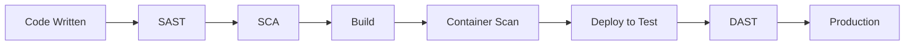

## Security in DevSecOps

Security should be integrated throughout the entire software development lifecycle. This section covers essential security practices, tools, and methodologies.

## Key Security Areas

<Cards>
  <Card title="SAST" href="/docs/security/sast" icon="Code" />
  <Card title="DAST" href="/docs/security/dast" icon="Search" />
  <Card title="SCA" href="/docs/security/sca" icon="Package" />
  <Card title="Secrets Management" href="/docs/security/secrets" icon="Key" />
  <Card title="Container Security" href="/docs/security/container-security" icon="Container" />
  <Card title="Security Best Practices" href="/docs/security/best-practices" icon="CheckCircle" />
</Cards>

## Security Shift-Left

Integrating security early in the development process helps:

- **Reduce costs**: Finding vulnerabilities early is cheaper to fix
- **Improve quality**: Better code security from the start
- **Increase speed**: Fewer security issues to resolve later
- **Build trust**: Demonstrate security commitment to customers

## Security Testing Types

## Getting Started

Start with [SAST](/docs/security/sast) to integrate static analysis into your workflow, then expand to other security practices.
