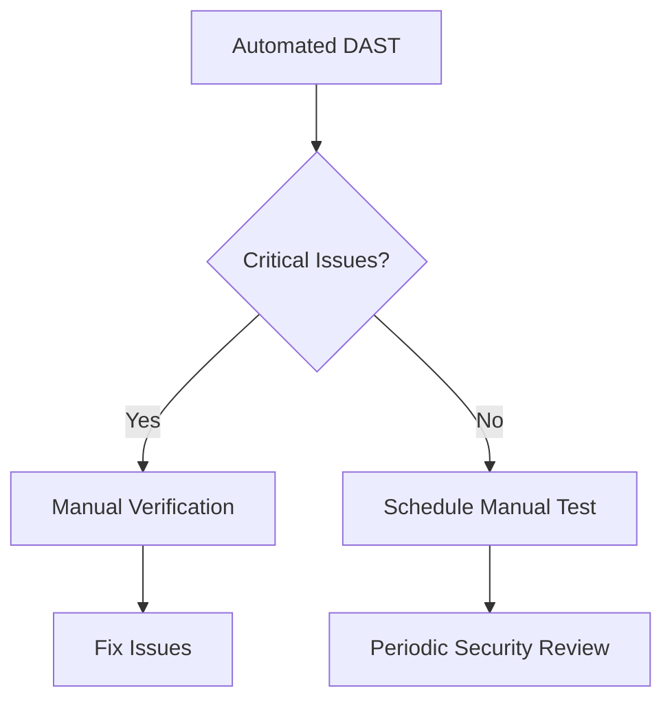

## What is DAST?

Dynamic Application Security Testing (DAST) tests running applications by simulating attacks from an external perspective, similar to how a real attacker would approach your system.

## Key Benefits

- **Real-world Testing**: Tests the running application
- **Configuration Issues**: Finds deployment and configuration problems
- **Authentication Testing**: Verifies security controls work correctly
- **No Source Code Required**: Black-box testing approach

## Popular DAST Tools

### Open Source

**OWASP ZAP** - Industry-standard web app scanner

```package-install
zaproxy
```

```bash
# Quick scan with ZAP
docker run -t ghcr.io/zaproxy/zaproxy:stable \
  zap-baseline.py -t https://your-app.com
```

**Nuclei** - Fast vulnerability scanner

```bash
# Install Nuclei
go install -v github.com/projectdiscovery/nuclei/v3/cmd/nuclei@latest

# Run scan
nuclei -u https://your-app.com -severity critical,high
```

### Commercial Tools

| Tool | Type | Best For |
|------|------|----------|
| Burp Suite Pro | Web | Manual + Auto testing |
| Acunetix | Web | Enterprise scanning |
| AppScan | Web/API | IBM ecosystem |
| Netsparker | Web | Proof-based scanning |

## DAST in CI/CD

### GitHub Actions Example

```yaml
name: DAST Scan

on:
  deployment_status:

jobs:
  dast:
    if: github.event.deployment_status.state == 'success'
    runs-on: ubuntu-latest
    
    steps:
      - name: Wait for app to be ready
        run: |
          sleep 30
          curl -f ${{ github.event.deployment_status.target_url }}
      
      - name: ZAP Baseline Scan
        uses: zaproxy/action-baseline@v0.10.0
        with:
          target: ${{ github.event.deployment_status.target_url }}
          rules_file_name: '.zap/rules.tsv'
          cmd_options: '-a'
          
      - name: Upload ZAP Report
        uses: actions/upload-artifact@v4
        if: always()
        with:
          name: zap-report
          path: report_html.html
```

### GitLab CI Example

```yaml
dast:
  stage: security
  image: ghcr.io/zaproxy/zaproxy:stable
  script:
    - zap-baseline.py -t $CI_ENVIRONMENT_URL -r report.html
  artifacts:
    when: always
    paths:
      - report.html
    expire_in: 1 week
  only:
    - schedules
```

## DAST Testing Scenarios

### 1. Authentication Testing

```yaml
# ZAP automation framework config
env:
  contexts:
    - name: "App Context"
      urls:
        - "https://your-app.com"
      authentication:
        method: "form"
        parameters:
          loginUrl: "https://your-app.com/login"
          loginRequestData: "username=&password="
        verification:
          method: "response"
          loggedInRegex: "\\QLogout\\E"
```

### 2. API Security Testing

```bash
# Nuclei API scanning
nuclei -u https://api.your-app.com \
  -t cves/ -t exposures/ -t vulnerabilities/ \
  -severity critical,high,medium
```

### 3. Authenticated Scanning

```python
# ZAP Python API
from zapv2 import ZAPv2

zap = ZAPv2(proxies={'http': 'http://127.0.0.1:8080'})

# Set up context
zap.context.new_context('MyApp')
zap.context.include_in_context('MyApp', 'https://your-app.com.*')

# Login
zap.authentication.set_logged_in_indicator('Logout')
zap.authentication.set_authentication_method(
    'MyApp',
    'formBasedAuthentication',
    'loginUrl=https://your-app.com/login'
)

# Start scan
scan_id = zap.spider.scan('https://your-app.com')
```

## Common Vulnerabilities Found

<Tabs items={['Web', 'API', 'Config']}>
  <Tab value="Web">
    - SQL Injection
    - Cross-Site Scripting (XSS)
    - CSRF
    - Broken Authentication
    - Security Misconfiguration
    - Sensitive Data Exposure
  </Tab>
  <Tab value="API">
    - Broken Object Level Authorization
    - Broken Authentication
    - Excessive Data Exposure
    - Lack of Rate Limiting
    - Mass Assignment
    - Security Misconfiguration
  </Tab>
  <Tab value="Config">
    - Default Credentials
    - Directory Listing
    - Verbose Error Messages
    - Missing Security Headers
    - SSL/TLS Issues
    - Unpatched Vulnerabilities
  </Tab>
</Tabs>

## Best Practices

### 1. Schedule Regular Scans

```yaml
# GitHub Actions - Weekly scheduled scan
on:
  schedule:
    - cron: '0 2 * * 1'  # Every Monday at 2 AM
```

### 2. Test in Staging

<Callout type="warn">
Always run DAST against non-production environments first. DAST tools can:
- Generate high traffic
- Modify data
- Trigger alerts
- Impact performance
</Callout>

### 3. Tune Your Scans

```tsv
# .zap/rules.tsv - Customize ZAP rules
10021	IGNORE	(Successful Authentication)
10094	IGNORE	(Base64 Disclosure)
10096	WARN	(Timestamp Disclosure)
```

### 4. Combine with Manual Testing



## DAST vs SAST

| Aspect | DAST | SAST |
|--------|------|------|
| **When** | Runtime | Development |
| **Access** | Black-box | White-box |
| **Coverage** | Running code | All code |
| **False Positives** | Lower | Higher |
| **Performance** | Slower | Faster |

## Next Steps

<Cards>
  <Card title="SAST" href="/docs/security/sast" />
  <Card title="Container Security" href="/docs/security/container-security" />
  <Card title="Security Best Practices" href="/docs/security/best-practices" />
</Cards>
