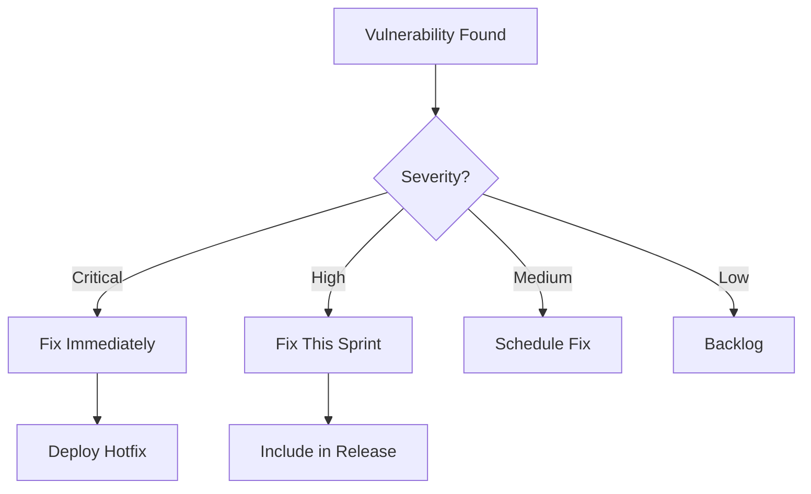

## What is SCA?

Software Composition Analysis (SCA) identifies security vulnerabilities and license compliance issues in open-source and third-party components used in your applications.

## Why SCA Matters

<Callout type="warn">
Modern applications consist of 70-90% open-source code. A single vulnerable dependency can compromise your entire application.
</Callout>

**Key Statistics:**
- Average project has 200+ dependencies
- 84% of codebases contain at least one vulnerability
- Supply chain attacks increased 742% in 2022

## Popular SCA Tools

### Open Source

**OWASP Dependency-Check**

```package-install
dependency-check
```

```bash
# Scan a Java project
dependency-check.sh --project MyApp --scan ./target

# Scan Node.js project
dependency-check.sh --project MyApp --scan ./package-lock.json
```

**npm audit / yarn audit**

```bash
# Check for vulnerabilities
npm audit

# Fix automatically where possible
npm audit fix

# Detailed report
npm audit --json > audit-report.json
```

**Safety (Python)**

```package-install
safety
```

```bash
# Check installed packages
safety check

# Check requirements file
safety check -r requirements.txt --json
```

### Commercial/Freemium Tools

| Tool | Languages | Features |
|------|-----------|----------|
| Snyk | 15+ | Dev-first, auto-fix |
| WhiteSource | 200+ | Enterprise, compliance |
| Sonatype Nexus | Java focus | Repository management |
| GitHub Dependabot | All | Native GitHub integration |

## SCA in CI/CD

### GitHub Actions with Snyk

```yaml
name: SCA Scan

on:
  push:
    branches: [main, develop]
  pull_request:
    branches: [main]
  schedule:
    - cron: '0 0 * * 0'  # Weekly

jobs:
  security:
    runs-on: ubuntu-latest
    steps:
      - uses: actions/checkout@v4
      
      - name: Run Snyk to check for vulnerabilities
        uses: snyk/actions/node@master
        env:
          SNYK_TOKEN: ${{ secrets.SNYK_TOKEN }}
        with:
          args: --severity-threshold=high
          
      - name: Upload result to GitHub Security
        uses: github/codeql-action/upload-sarif@v3
        with:
          sarif_file: snyk.sarif
```

### GitLab CI with Dependency Scanning

```yaml
include:
  - template: Security/Dependency-Scanning.gitlab-ci.yml

dependency_scanning:
  variables:
    DS_PYTHON_VERSION: "3"
    DS_EXCLUDED_PATHS: "spec, test, tests, tmp"
  artifacts:
    reports:
      dependency_scanning: gl-dependency-scanning-report.json
```

### Multi-Language Pipeline

```yaml
name: Multi-Language SCA

jobs:
  scan-node:
    runs-on: ubuntu-latest
    steps:
      - uses: actions/checkout@v4
      - uses: actions/setup-node@v4
      - run: npm audit --audit-level=moderate

  scan-python:
    runs-on: ubuntu-latest
    steps:
      - uses: actions/checkout@v4
      - uses: actions/setup-python@v5
      - run: |
          pip install safety
          safety check --json

  scan-go:
    runs-on: ubuntu-latest
    steps:
      - uses: actions/checkout@v4
      - uses: actions/setup-go@v5
      - run: go list -json -m all | nancy sleuth

  scan-java:
    runs-on: ubuntu-latest
    steps:
      - uses: actions/checkout@v4
      - name: OWASP Dependency Check
        uses: dependency-check/Dependency-Check_Action@main
        with:
          project: 'MyApp'
          path: '.'
          format: 'ALL'
```

## Vulnerability Management

### 1. Severity Prioritization



### 2. Automated Dependency Updates

**Dependabot Configuration** (`.github/dependabot.yml`)

```yaml
version: 2
updates:
  - package-ecosystem: "npm"
    directory: "/"
    schedule:
      interval: "weekly"
    open-pull-requests-limit: 10
    reviewers:
      - "security-team"
    labels:
      - "dependencies"
      - "security"
    
  - package-ecosystem: "pip"
    directory: "/"
    schedule:
      interval: "daily"
    allow:
      - dependency-type: "direct"
        update-types: ["security"]
    
  - package-ecosystem: "docker"
    directory: "/"
    schedule:
      interval: "weekly"
```

**Renovate Configuration** (`renovate.json`)

```json
{
  "extends": ["config:base"],
  "vulnerabilityAlerts": {
    "enabled": true,
    "labels": ["security"]
  },
  "packageRules": [
    {
      "matchUpdateTypes": ["minor", "patch"],
      "automerge": true
    },
    {
      "matchDepTypes": ["devDependencies"],
      "automerge": true
    }
  ]
}
```

## Language-Specific Examples

<Tabs items={['Node.js', 'Python', 'Java', 'Go']}>
  <Tab value="Node.js">
    ```bash
    # Check for vulnerabilities
    npm audit
    
    # Generate detailed report
    npm audit --json > audit.json
    
    # Fix vulnerabilities
    npm audit fix
    
    # Force fix (may break changes)
    npm audit fix --force
    
    # Using yarn
    yarn audit
    yarn upgrade-interactive --latest
    ```
  </Tab>
  <Tab value="Python">
    ```bash
    # Using Safety
    pip install safety
    safety check
    safety check --json --output safety-report.json
    
    # Using pip-audit
    pip install pip-audit
    pip-audit
    
    # Check specific requirements file
    pip-audit -r requirements.txt
    ```
  </Tab>
  <Tab value="Java">
    ```bash
    # Maven Dependency Check
    mvn org.owasp:dependency-check-maven:check
    
    # Gradle
    ./gradlew dependencyCheckAnalyze
    
    # Generate report
    mvn dependency-check:aggregate \
      -DfailBuildOnCVSS=7 \
      -DsuppressionFile=suppressions.xml
    ```
  </Tab>
  <Tab value="Go">
    ```bash
    # Using Nancy
    go list -json -m all | nancy sleuth
    
    # Using govulncheck
    go install golang.org/x/vuln/cmd/govulncheck@latest
    govulncheck ./...
    
    # Snyk for Go
    snyk test
    ```
  </Tab>
</Tabs>

## License Compliance

### Scanning for License Issues

```bash
# Using license-checker (Node.js)
npm install -g license-checker
license-checker --summary

# Generate CSV report
license-checker --csv --out licenses.csv

# Check for specific licenses
license-checker --onlyAllow "MIT;Apache-2.0;BSD-3-Clause"
```

### Common License Types

| License | Commercial Use | Modifications | Distribution |
|---------|----------------|---------------|--------------|
| MIT | ✅ | ✅ | ✅ |
| Apache 2.0 | ✅ | ✅ | ✅ |
| GPL-3.0 | ⚠️ | ✅ | ✅ (copyleft) |
| BSD-3 | ✅ | ✅ | ✅ |
| ISC | ✅ | ✅ | ✅ |

## Best Practices

### 1. Regular Scanning

```yaml
# Schedule daily security scans
on:
  schedule:
    - cron: '0 8 * * *'  # Daily at 8 AM
```

### 2. Fail Builds on Critical Issues

```bash
# Fail if CVSS score >= 7.0
snyk test --severity-threshold=high

# npm audit
npm audit --audit-level=high
```

### 3. Maintain a Software Bill of Materials (SBOM)

```bash
# Generate SBOM with Syft
syft packages dir:. -o json > sbom.json

# CycloneDX format
cyclonedx-bom -o sbom.xml
```

### 4. Create Suppression Files

```xml
<!-- dependency-check suppressions.xml -->
<suppressions>
  <suppress>
    <notes>False positive - not using vulnerable component</notes>
    <packageUrl regex="true">^pkg:maven/com\.example/.*$</packageUrl>
    <cve>CVE-2021-12345</cve>
  </suppress>
</suppressions>
```

## Remediation Strategies

<Steps>
  <Step>**Identify**: Scan and catalog all dependencies</Step>
  <Step>**Assess**: Evaluate severity and exploitability</Step>
  <Step>**Prioritize**: Focus on critical/high vulnerabilities</Step>
  <Step>**Update**: Upgrade to patched versions</Step>
  <Step>**Test**: Verify fixes don't break functionality</Step>
  <Step>**Monitor**: Continuous scanning for new issues</Step>
</Steps>

## Next Steps

<Cards>
  <Card title="Container Security" href="/docs/security/container-security" />
  <Card title="Secrets Management" href="/docs/security/secrets" />
  <Card title="CI/CD Security" href="/docs/cicd/security" />
</Cards>
