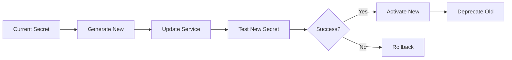

## What are Secrets?

Secrets are sensitive pieces of information that provide access to systems, services, or data:

- API keys and tokens
- Database credentials
- Private keys and certificates
- OAuth tokens
- Encryption keys
- Service account credentials

<Callout type="error">
**Never commit secrets to version control!** Exposed secrets are the #1 cause of data breaches.
</Callout>

## Secret Detection Tools

### GitGuardian / TruffleHog

```package-install
trufflesecurity/trufflehog
```

```bash
# Scan git history
trufflehog git https://github.com/your-org/your-repo

# Scan local files
trufflehog filesystem ./

# Scan Docker images
trufflehog docker --image myimage:latest
```

### Gitleaks

```bash
# Install
brew install gitleaks

# Scan repository
gitleaks detect --source . --verbose

# Pre-commit hook
gitleaks protect --staged --verbose
```

### GitHub Secret Scanning

Automatically enabled for public repos. For private repos:

```yaml
# .github/workflows/secret-scan.yml
name: Secret Scanning

on: [push, pull_request]

jobs:
  scan:
    runs-on: ubuntu-latest
    steps:
      - uses: actions/checkout@v4
        with:
          fetch-depth: 0
      
      - name: Gitleaks
        uses: gitleaks/gitleaks-action@v2
        env:
          GITHUB_TOKEN: ${{ secrets.GITHUB_TOKEN }}
```

## Secrets Management Solutions

### HashiCorp Vault

**Installation:**

```bash
# Docker
docker run -d --name=vault \
  --cap-add=IPC_LOCK \
  -p 8200:8200 \
  hashicorp/vault server -dev

# Export vault address
export VAULT_ADDR='http://127.0.0.1:8200'
```

**Usage:**

```bash
# Store secret
vault kv put secret/myapp/config \
  api_key=abc123 \
  db_password=secret123

# Retrieve secret
vault kv get secret/myapp/config

# Use in application
vault kv get -field=api_key secret/myapp/config
```

**Application Integration:**

```python
import hvac

# Initialize client
client = hvac.Client(url='http://127.0.0.1:8200')
client.token = 'dev-token'

# Read secret
secret = client.secrets.kv.v2.read_secret_version(
    path='myapp/config'
)

api_key = secret['data']['data']['api_key']
```

### AWS Secrets Manager

```bash
# Store secret
aws secretsmanager create-secret \
  --name myapp/db/password \
  --secret-string "my-super-secret-password"

# Retrieve secret
aws secretsmanager get-secret-value \
  --secret-id myapp/db/password \
  --query SecretString \
  --output text
```

**In Application:**

```python
import boto3
import json

def get_secret(secret_name):
    client = boto3.client('secretsmanager')
    response = client.get_secret_value(SecretId=secret_name)
    return json.loads(response['SecretString'])

# Usage
secrets = get_secret('myapp/db/password')
db_password = secrets['password']
```

### Azure Key Vault

```bash
# Create Key Vault
az keyvault create \
  --name myKeyVault \
  --resource-group myResourceGroup \
  --location eastus

# Store secret
az keyvault secret set \
  --vault-name myKeyVault \
  --name "db-password" \
  --value "my-secret-password"

# Retrieve secret
az keyvault secret show \
  --name "db-password" \
  --vault-name myKeyVault \
  --query "value"
```

### Google Cloud Secret Manager

```bash
# Create secret
gcloud secrets create db-password \
  --data-file=-

# Access secret
gcloud secrets versions access latest \
  --secret="db-password"
```

## CI/CD Integration

### GitHub Actions Secrets

```yaml
name: Deploy

on: [push]

jobs:
  deploy:
    runs-on: ubuntu-latest
    steps:
      - uses: actions/checkout@v4
      
      - name: Deploy to production
        env:
          API_KEY: ${{ secrets.API_KEY }}
          DB_PASSWORD: ${{ secrets.DB_PASSWORD }}
        run: |
          echo "Deploying with credentials"
          ./deploy.sh
```

**Organization-level secrets:**

```yaml
# Available across all repos in org
jobs:
  deploy:
    environment: production
    steps:
      - name: Use org secret
        env:
          SHARED_TOKEN: ${{ secrets.ORG_DEPLOY_TOKEN }}
```

### GitLab CI Variables

```yaml
deploy:
  stage: deploy
  script:
    - echo "Deploying with ${API_KEY}"
    - ./deploy.sh
  environment:
    name: production
  variables:
    DEPLOY_ENV: "production"
  only:
    - main
```

### Jenkins Credentials

```groovy
pipeline {
    agent any
    
    environment {
        API_KEY = credentials('api-key-id')
        DB_CREDS = credentials('database-credentials')
    }
    
    stages {
        stage('Deploy') {
            steps {
                sh '''
                    echo "Using API key: ${API_KEY}"
                    ./deploy.sh
                '''
            }
        }
    }
}
```

## Environment-Specific Secrets

### Docker Secrets

```bash
# Create secret
echo "my-db-password" | docker secret create db_password -

# Use in service
docker service create \
  --name myapp \
  --secret db_password \
  myapp:latest
```

**docker-compose.yml:**

```yaml
version: '3.8'

services:
  app:
    image: myapp:latest
    secrets:
      - db_password
      - api_key

secrets:
  db_password:
    external: true
  api_key:
    external: true
```

### Kubernetes Secrets

```yaml
# Create secret
apiVersion: v1
kind: Secret
metadata:
  name: app-secrets
type: Opaque
stringData:
  api-key: "abc123xyz"
  db-password: "super-secret"
```

```bash
# Create from command line
kubectl create secret generic app-secrets \
  --from-literal=api-key=abc123xyz \
  --from-literal=db-password=super-secret
```

**Using in Pods:**

```yaml
apiVersion: v1
kind: Pod
metadata:
  name: myapp
spec:
  containers:
  - name: app
    image: myapp:latest
    env:
    - name: API_KEY
      valueFrom:
        secretKeyRef:
          name: app-secrets
          key: api-key
    volumeMounts:
    - name: secrets
      mountPath: "/etc/secrets"
      readOnly: true
  volumes:
  - name: secrets
    secret:
      secretName: app-secrets
```

## .env File Management

### Never Commit .env Files

**.gitignore:**

```text
# Environment files
.env
.env.local
.env.*.local
.env.production

# Secrets
secrets/
*.key
*.pem
*.p12
```

### Use .env.example

```bash
# .env.example - Safe to commit
API_KEY=your_api_key_here
DB_HOST=localhost
DB_PORT=5432
DB_NAME=myapp
DB_USER=user
DB_PASSWORD=your_password_here
```

### Load Environment Variables

**Node.js:**

```javascript
require('dotenv').config();

const apiKey = process.env.API_KEY;
const dbPassword = process.env.DB_PASSWORD;
```

**Python:**

```python
from dotenv import load_dotenv
import os

load_dotenv()

api_key = os.getenv('API_KEY')
db_password = os.getenv('DB_PASSWORD')
```

## Secret Rotation

### Automated Rotation

```python
# Example: Rotate AWS secret
import boto3
from datetime import datetime, timedelta

def rotate_secret(secret_name):
    client = boto3.client('secretsmanager')
    
    # Generate new password
    new_password = generate_secure_password()
    
    # Update in Secrets Manager
    client.update_secret(
        SecretId=secret_name,
        SecretString=new_password
    )
    
    # Update in actual service (e.g., database)
    update_database_password(new_password)
    
    print(f"Secret {secret_name} rotated successfully")

# Schedule rotation
if __name__ == '__main__':
    rotate_secret('myapp/db/password')
```

### Rotation Policy



## Best Practices

### 1. Never Hardcode Secrets

❌ **Bad:**
```python
api_key = "sk-abc123xyz456"
db_password = "mypassword123"
```

✅ **Good:**
```python
api_key = os.environ.get('API_KEY')
db_password = os.environ.get('DB_PASSWORD')
```

### 2. Use Different Secrets per Environment

```bash
# Development
API_KEY_DEV=dev-key-123

# Staging
API_KEY_STAGING=staging-key-456

# Production
API_KEY_PROD=prod-key-789
```

### 3. Implement Least Privilege

```yaml
# Kubernetes RBAC for secrets
apiVersion: rbac.authorization.k8s.io/v1
kind: Role
metadata:
  name: secret-reader
rules:
- apiGroups: [""]
  resources: ["secrets"]
  verbs: ["get", "list"]
  resourceNames: ["app-secrets"]
```

### 4. Monitor Secret Access

```python
# Log secret access
import logging

logger = logging.getLogger(__name__)

def get_secret(secret_name):
    logger.info(f"Accessing secret: {secret_name}")
    # Retrieve secret
    return vault_client.get_secret(secret_name)
```

### 5. Set Expiration Dates

```bash
# Create secret with expiration
vault write secret/temp-token \
  token=abc123 \
  ttl=1h
```

## Secret Scanning in CI/CD

```yaml
name: Security Scan

on: [push, pull_request]

jobs:
  secret-scan:
    runs-on: ubuntu-latest
    steps:
      - uses: actions/checkout@v4
        with:
          fetch-depth: 0
      
      - name: TruffleHog
        uses: trufflesecurity/trufflehog@main
        with:
          path: ./
          base: ${{ github.event.repository.default_branch }}
          head: HEAD
          
      - name: Gitleaks
        uses: gitleaks/gitleaks-action@v2
        
      - name: Fail if secrets found
        if: failure()
        run: exit 1
```

## Emergency Response

### If a Secret is Exposed:

<Steps>
  <Step>**Revoke immediately**: Disable the exposed credential</Step>
  <Step>**Generate new secret**: Create replacement credentials</Step>
  <Step>**Update systems**: Deploy new secret to all systems</Step>
  <Step>**Audit access logs**: Check for unauthorized use</Step>
  <Step>**Remove from history**: Use tools like BFG Repo-Cleaner</Step>
  <Step>**Document incident**: Record for future prevention</Step>
</Steps>

```bash
# Remove secret from git history
git filter-branch --force --index-filter \
  "git rm --cached --ignore-unmatch path/to/secret" \
  --prune-empty --tag-name-filter cat -- --all
```

## Next Steps

<Cards>
  <Card title="Container Security" href="/docs/security/container-security" />
  <Card title="CI/CD Security" href="/docs/cicd/security" />
  <Card title="Infrastructure as Code" href="/docs/infrastructure/iac" />
</Cards>
