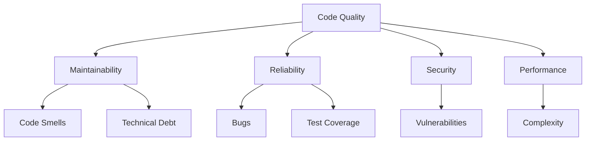

## Code Quality Fundamentals

High-quality code is readable, maintainable, testable, and performant. It follows established patterns and conventions.

## Code Quality Metrics



## Linters and Formatters

### JavaScript/TypeScript

**ESLint**

```package-install
eslint --save-dev
```

```json
// .eslintrc.json
{
  "extends": [
    "eslint:recommended",
    "plugin:@typescript-eslint/recommended",
    "plugin:security/recommended"
  ],
  "plugins": ["@typescript-eslint", "security"],
  "rules": {
    "no-console": "warn",
    "no-unused-vars": "error",
    "@typescript-eslint/explicit-function-return-type": "warn",
    "security/detect-object-injection": "error"
  }
}
```

**Prettier**

```json
// .prettierrc
{
  "semi": true,
  "trailingComma": "es5",
  "singleQuote": true,
  "printWidth": 80,
  "tabWidth": 2
}
```

```bash
# Format code
npx prettier --write "src/**/*.{ts,tsx,js,jsx}"

# Check formatting
npx prettier --check "src/**/*.{ts,tsx,js,jsx}"
```

### Python

**Black**

```package-install
black
```

```bash
# Format code
black .

# Check formatting
black --check .
```

**Pylint**

```package-install
pylint
```

```ini
# .pylintrc
[MASTER]
disable=
    C0114,  # missing-module-docstring
    C0115,  # missing-class-docstring
    C0116   # missing-function-docstring

max-line-length=100

[MESSAGES CONTROL]
enable=
    useless-suppression
```

**Flake8**

```bash
# Install
pip install flake8

# Run
flake8 .

# Configuration: .flake8
[flake8]
max-line-length = 100
exclude = .git,__pycache__,venv
ignore = E203,W503
```

### Go

**golangci-lint**

```yaml
# .golangci.yml
linters:
  enable:
    - gofmt
    - golint
    - govet
    - errcheck
    - staticcheck
    - gosec
    - goconst
    - misspell

linters-settings:
  govet:
    check-shadowing: true
  golint:
    min-confidence: 0.8
```

```bash
# Run linter
golangci-lint run
```

### Java

**Checkstyle**

```xml
<!-- checkstyle.xml -->
<?xml version="1.0"?>
<!DOCTYPE module PUBLIC
  "-//Checkstyle//DTD Checkstyle Configuration 1.3//EN"
  "https://checkstyle.org/dtds/configuration_1_3.dtd">

<module name="Checker">
  <module name="TreeWalker">
    <module name="JavadocMethod"/>
    <module name="MissingJavadocMethod"/>
    <module name="ConstantName"/>
    <module name="LocalFinalVariableName"/>
    <module name="LocalVariableName"/>
    <module name="MemberName"/>
    <module name="MethodName"/>
    <module name="PackageName"/>
    <module name="ParameterName"/>
    <module name="StaticVariableName"/>
    <module name="TypeName"/>
  </module>
</module>
```

## Static Analysis Tools

### SonarQube

```yaml
# docker-compose.yml
version: '3'
services:
  sonarqube:
    image: sonarqube:community
    ports:
      - "9000:9000"
    environment:
      - SONAR_ES_BOOTSTRAP_CHECKS_DISABLE=true
    volumes:
      - sonarqube_data:/opt/sonarqube/data
      - sonarqube_logs:/opt/sonarqube/logs
      - sonarqube_extensions:/opt/sonarqube/extensions

volumes:
  sonarqube_data:
  sonarqube_logs:
  sonarqube_extensions:
```

**Configuration:**

```properties
# sonar-project.properties
sonar.projectKey=my-project
sonar.projectName=My Project
sonar.projectVersion=1.0
sonar.sources=src
sonar.tests=tests
sonar.sourceEncoding=UTF-8

# Coverage
sonar.javascript.lcov.reportPaths=coverage/lcov.info
sonar.python.coverage.reportPaths=coverage.xml

# Quality Gates
sonar.qualitygate.wait=true
```

**CI Integration:**

```yaml
# GitHub Actions
name: SonarQube Analysis

on:
  push:
    branches: [main]
  pull_request:
    branches: [main]

jobs:
  sonarqube:
    runs-on: ubuntu-latest
    steps:
      - uses: actions/checkout@v4
        with:
          fetch-depth: 0
      
      - name: SonarQube Scan
        uses: sonarsource/sonarqube-scan-action@master
        env:
          SONAR_TOKEN: ${{ secrets.SONAR_TOKEN }}
          SONAR_HOST_URL: ${{ secrets.SONAR_HOST_URL }}
      
      - name: SonarQube Quality Gate
        uses: sonarsource/sonarqube-quality-gate-action@master
        timeout-minutes: 5
        env:
          SONAR_TOKEN: ${{ secrets.SONAR_TOKEN }}
```

### CodeClimate

```yaml
# .codeclimate.yml
version: "2"
checks:
  argument-count:
    enabled: true
    config:
      threshold: 4
  complex-logic:
    enabled: true
    config:
      threshold: 4
  file-lines:
    enabled: true
    config:
      threshold: 250
  method-complexity:
    enabled: true
    config:
      threshold: 5
  method-count:
    enabled: true
    config:
      threshold: 20
  method-lines:
    enabled: true
    config:
      threshold: 25

plugins:
  eslint:
    enabled: true
  duplication:
    enabled: true
    config:
      languages:
        javascript:
          mass_threshold: 50
```

## Code Complexity

### Cyclomatic Complexity

```python
# ❌ Bad: High complexity (CC = 8)
def process_user(user, action, role, status):
    if user is None:
        return None
    if action == 'create':
        if role == 'admin':
            if status == 'active':
                return create_admin(user)
            else:
                return create_inactive_admin(user)
        else:
            if status == 'active':
                return create_user(user)
            else:
                return create_inactive_user(user)
    elif action == 'delete':
        return delete_user(user)
    return None

# ✅ Good: Lower complexity (CC = 3)
def process_user(user, action, role, status):
    if user is None:
        return None
    
    handlers = {
        'create': lambda: create_user_handler(user, role, status),
        'delete': lambda: delete_user(user)
    }
    
    handler = handlers.get(action)
    return handler() if handler else None

def create_user_handler(user, role, status):
    factory = UserFactory(role, status)
    return factory.create(user)
```

### Measuring Complexity

```bash
# JavaScript/TypeScript
npx complexity-report src/

# Python
pip install radon
radon cc -a src/

# Go
gocyclo -over 10 .

# Java
mvn pmd:pmd
```

## Code Duplication Detection

```bash
# JavaScript - jscpd
npx jscpd src/

# Python - pylint
pylint --disable=all --enable=duplicate-code src/

# Multi-language - PMD CPD
pmd cpd --minimum-tokens 100 --files src/
```

## Pre-commit Hooks

### Husky (JavaScript)

```package-install
husky lint-staged --save-dev
```

```json
// package.json
{
  "scripts": {
    "prepare": "husky install"
  },
  "lint-staged": {
    "*.{js,jsx,ts,tsx}": [
      "eslint --fix",
      "prettier --write"
    ],
    "*.{json,md}": [
      "prettier --write"
    ]
  }
}
```

```bash
# Create pre-commit hook
npx husky add .husky/pre-commit "npx lint-staged"
```

### Pre-commit (Python)

```yaml
# .pre-commit-config.yaml
repos:
  - repo: https://github.com/pre-commit/pre-commit-hooks
    rev: v4.5.0
    hooks:
      - id: trailing-whitespace
      - id: end-of-file-fixer
      - id: check-yaml
      - id: check-added-large-files
  
  - repo: https://github.com/psf/black
    rev: 23.12.1
    hooks:
      - id: black
  
  - repo: https://github.com/pycqa/flake8
    rev: 7.0.0
    hooks:
      - id: flake8
        args: [--max-line-length=100]
  
  - repo: https://github.com/pycqa/isort
    rev: 5.13.2
    hooks:
      - id: isort
```

```bash
# Install
pip install pre-commit
pre-commit install

# Run manually
pre-commit run --all-files
```

## Documentation Standards

### JSDoc

```typescript
/**
 * Calculates the total price with tax
 * @param {number} price - The base price
 * @param {number} taxRate - Tax rate as decimal (e.g., 0.08 for 8%)
 * @returns {number} The total price including tax
 * @throws {Error} If price or taxRate is negative
 * @example
 * const total = calculateTotal(100, 0.08);
 * // returns 108
 */
function calculateTotal(price: number, taxRate: number): number {
  if (price < 0 || taxRate < 0) {
    throw new Error('Price and tax rate must be non-negative');
  }
  return price * (1 + taxRate);
}
```

### Python Docstrings

```python
def calculate_total(price: float, tax_rate: float) -> float:
    """
    Calculate the total price with tax.
    
    Args:
        price: The base price (must be non-negative)
        tax_rate: Tax rate as decimal (e.g., 0.08 for 8%)
    
    Returns:
        The total price including tax
    
    Raises:
        ValueError: If price or tax_rate is negative
    
    Examples:
        >>> calculate_total(100, 0.08)
        108.0
    """
    if price < 0 or tax_rate < 0:
        raise ValueError('Price and tax rate must be non-negative')
    return price * (1 + tax_rate)
```

## CI/CD Integration

```yaml
name: Code Quality

on: [push, pull_request]

jobs:
  lint:
    runs-on: ubuntu-latest
    steps:
      - uses: actions/checkout@v4
      
      - name: Setup Node.js
        uses: actions/setup-node@v4
        with:
          node-version: '20'
      
      - name: Install dependencies
        run: npm ci
      
      - name: Run ESLint
        run: npm run lint
      
      - name: Run Prettier
        run: npm run format:check
      
      - name: Check TypeScript
        run: npm run type-check

  complexity:
    runs-on: ubuntu-latest
    steps:
      - uses: actions/checkout@v4
      
      - name: Complexity Report
        run: |
          npx complexity-report src/ \
            --format json \
            --output complexity.json
      
      - name: Upload Report
        uses: actions/upload-artifact@v4
        with:
          name: complexity-report
          path: complexity.json

  sonarqube:
    runs-on: ubuntu-latest
    steps:
      - uses: actions/checkout@v4
        with:
          fetch-depth: 0
      
      - name: SonarQube Scan
        uses: sonarsource/sonarqube-scan-action@master
        env:
          SONAR_TOKEN: ${{ secrets.SONAR_TOKEN }}
          SONAR_HOST_URL: ${{ secrets.SONAR_HOST_URL }}
```

## Best Practices

<Steps>
  <Step>**Automate**: Use tools to enforce standards automatically</Step>
  <Step>**Consistency**: Follow team conventions and style guides</Step>
  <Step>**Review**: Regular code reviews catch issues early</Step>
  <Step>**Refactor**: Continuously improve code quality</Step>
  <Step>**Document**: Write clear, maintainable documentation</Step>
  <Step>**Measure**: Track metrics and improve over time</Step>
</Steps>

## Next Steps

<Cards>
  <Card title="Testing" href="/docs/dev/testing" />
  <Card title="Code Review" href="/docs/dev/code-review" />
  <Card title="Version Control" href="/docs/dev/version-control" />
</Cards>
