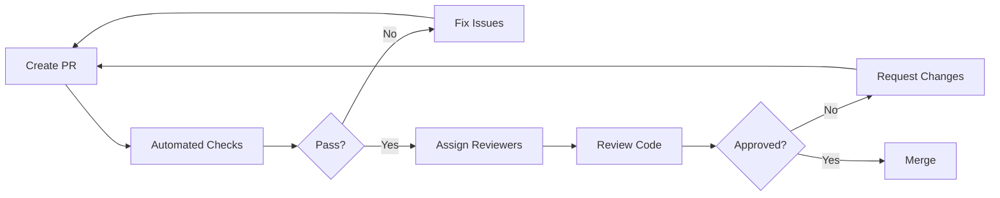

## Code Review in DevSecOps

Code review is a critical quality gate that improves code quality, shares knowledge, and catches issues before production.

## Benefits of Code Review

<Cards>
  <Card title="Quality" description="Catch bugs and improve code quality" />
  <Card title="Knowledge" description="Share knowledge across the team" />
  <Card title="Standards" description="Enforce coding standards" />
  <Card title="Security" description="Identify security vulnerabilities" />
</Cards>

## Code Review Process



## Pull Request Template

```markdown
## Description
Brief description of changes

## Type of Change
- [ ] Bug fix
- [ ] New feature
- [ ] Breaking change
- [ ] Documentation update

## Related Issues
Closes #123
Related to #456

## Changes Made
- Added user authentication
- Implemented password hashing
- Added unit tests

## Testing
- [ ] Unit tests pass
- [ ] Integration tests pass
- [ ] Manual testing completed

## Screenshots (if applicable)
[Add screenshots here]

## Checklist
- [ ] Code follows style guidelines
- [ ] Self-review completed
- [ ] Comments added for complex logic
- [ ] Documentation updated
- [ ] No new warnings generated
- [ ] Tests added/updated
- [ ] All tests pass
- [ ] Security considerations addressed

## Additional Notes
Any additional context or notes for reviewers
```

**GitHub Template (.github/PULL_REQUEST_TEMPLATE.md):**

```markdown
<!-- Please fill out this template when creating a PR -->

## What does this PR do?
<!-- Brief description of the changes -->

## Why is this change needed?
<!-- Explain the problem this PR solves -->

## Related Issues
<!-- Link related issues: Fixes #123, Related to #456 -->

## How has this been tested?
<!-- Describe testing approach and results -->

## Review checklist
- [ ] Code quality (readability, maintainability)
- [ ] Tests (adequate coverage, edge cases)
- [ ] Security (no vulnerabilities introduced)
- [ ] Performance (no degradation)
- [ ] Documentation (updated if needed)

/cc @team-lead @security-reviewer
```

## Review Guidelines

### What to Look For

#### 1. **Code Quality**

```typescript
// ❌ Bad: Unclear, complex logic
function p(d) {
  return d.filter(i => i.a && !i.b).map(i => ({...i, c: i.a * 2}));
}

// ✅ Good: Clear, well-named, simple
interface Item {
  id: string;
  isActive: boolean;
  isDeleted: boolean;
  price: number;
}

function getActiveItemsWithDiscount(items: Item[]) {
  const activeItems = items.filter(item => 
    item.isActive && !item.isDeleted
  );
  
  return activeItems.map(item => ({
    ...item,
    discountedPrice: item.price * 0.8
  }));
}
```

#### 2. **Security Issues**

```python
# ❌ Bad: SQL injection vulnerability
def get_user(user_id):
    query = f"SELECT * FROM users WHERE id = {user_id}"
    return db.execute(query)

# ✅ Good: Parameterized query
def get_user(user_id):
    query = "SELECT * FROM users WHERE id = ?"
    return db.execute(query, (user_id,))
```

#### 3. **Error Handling**

```javascript
// ❌ Bad: Silent failure
async function fetchData() {
  try {
    return await api.getData();
  } catch (error) {
    return null;
  }
}

// ✅ Good: Proper error handling
async function fetchData() {
  try {
    return await api.getData();
  } catch (error) {
    logger.error('Failed to fetch data:', error);
    throw new DataFetchError('Unable to retrieve data', { cause: error });
  }
}
```

#### 4. **Performance**

```python
# ❌ Bad: N+1 query problem
def get_users_with_posts():
    users = User.query.all()
    for user in users:
        user.posts = Post.query.filter_by(user_id=user.id).all()
    return users

# ✅ Good: Eager loading
def get_users_with_posts():
    return User.query.options(
        joinedload(User.posts)
    ).all()
```

#### 5. **Testing**

```typescript
// ✅ Good: Comprehensive test coverage
describe('calculateTotal', () => {
  it('should calculate total with tax', () => {
    expect(calculateTotal(100, 0.08)).toBe(108);
  });

  it('should handle zero price', () => {
    expect(calculateTotal(0, 0.08)).toBe(0);
  });

  it('should handle zero tax', () => {
    expect(calculateTotal(100, 0)).toBe(100);
  });

  it('should throw on negative values', () => {
    expect(() => calculateTotal(-100, 0.08)).toThrow();
  });
});
```

### Review Comments

#### ✅ Good Review Comments

```markdown
**Suggestion: Consider extracting this logic**
This validation logic appears in multiple places. Consider extracting it 
into a reusable function:

```typescript
function validateEmail(email: string): boolean {
  const emailRegex = /^[^\s@]+@[^\s@]+\.[^\s@]+$/;
  return emailRegex.test(email);
}
```

**Question: How does this handle edge cases?**
What happens when the input array is empty? Should we return an empty 
array or throw an error?

**Nit: Variable naming**
Consider renaming `d` to `data` for better readability.

**Security: Potential injection vulnerability**
This query construction is vulnerable to SQL injection. Please use 
parameterized queries instead. See: [link to docs]

**Praise: Nice refactoring!**
This is much more readable than the previous implementation. Great job!
```

#### ❌ Bad Review Comments

```markdown
"This is wrong." // Not helpful - no explanation

"Why did you do it this way?" // Sounds accusatory

"I would have done this differently." // Not constructive

"This won't work." // No reasoning provided

"lgtm" // Too vague, no real review
```

## Review Best Practices

### For Authors

<Steps>
  <Step>**Self-review first**: Review your own code before requesting review</Step>
  <Step>**Keep it small**: Aim for less than 400 lines changed per PR</Step>
  <Step>**Clear description**: Explain what, why, and how</Step>
  <Step>**Add context**: Link issues, add screenshots, explain decisions</Step>
  <Step>**Respond promptly**: Address feedback quickly</Step>
  <Step>**Be open**: Accept feedback gracefully</Step>
</Steps>

### For Reviewers

<Steps>
  <Step>**Review promptly**: Within 24 hours ideally</Step>
  <Step>**Be constructive**: Suggest improvements, don't just criticize</Step>
  <Step>**Explain reasoning**: Provide context for your comments</Step>
  <Step>**Ask questions**: Seek to understand before judging</Step>
  <Step>**Praise good work**: Acknowledge positive changes</Step>
  <Step>**Be respectful**: Focus on code, not the person</Step>
</Steps>

## Automated Code Review

### GitHub Actions

```yaml
name: Code Review Automation

on:
  pull_request:
    types: [opened, synchronize]

jobs:
  lint:
    runs-on: ubuntu-latest
    steps:
      - uses: actions/checkout@v4
      
      - name: Run linter
        uses: github/super-linter@v5
        env:
          GITHUB_TOKEN: ${{ secrets.GITHUB_TOKEN }}

  test:
    runs-on: ubuntu-latest
    steps:
      - uses: actions/checkout@v4
      
      - name: Run tests
        run: npm test
      
      - name: Comment on PR
        uses: actions/github-script@v7
        with:
          script: |
            github.rest.issues.createComment({
              issue_number: context.issue.number,
              owner: context.repo.owner,
              repo: context.repo.repo,
              body: '✅ All tests passed!'
            })

  size-label:
    runs-on: ubuntu-latest
    steps:
      - uses: actions/checkout@v4
      
      - name: Size Label
        uses: pascalgn/size-label-action@v0.5.0
        env:
          GITHUB_TOKEN: ${{ secrets.GITHUB_TOKEN }}

  danger:
    runs-on: ubuntu-latest
    steps:
      - uses: actions/checkout@v4
      
      - name: Danger JS
        uses: danger/danger-js@11.2.6
        env:
          GITHUB_TOKEN: ${{ secrets.GITHUB_TOKEN }}
```

### Danger JS

```typescript
// dangerfile.ts
import { danger, warn, fail, message } from 'danger';

// PR is too big
const bigPRThreshold = 400;
if (danger.github.pr.additions + danger.github.pr.deletions > bigPRThreshold) {
  warn(':exclamation: This PR is quite large. Consider splitting it into smaller PRs.');
}

// PR has no description
if (danger.github.pr.body.length < 10) {
  fail('Please provide a description for this PR.');
}

// Modified files need tests
const modifiedFiles = danger.git.modified_files;
const testFiles = modifiedFiles.filter(f => f.includes('.test.') || f.includes('.spec.'));

if (modifiedFiles.length > 0 && testFiles.length === 0) {
  warn('This PR modifies code but doesn\'t include tests. Consider adding tests.');
}

// Check for console.log
const jsFiles = [...modifiedFiles].filter(f => f.endsWith('.js') || f.endsWith('.ts'));
for (const file of jsFiles) {
  const content = await danger.github.utils.fileContents(file);
  if (content.includes('console.log')) {
    warn(`\`console.log\` found in ${file}. Consider using a proper logger.`);
  }
}

// Check for TODO comments
for (const file of modifiedFiles) {
  const content = await danger.github.utils.fileContents(file);
  const todos = content.match(/TODO:/gi);
  if (todos) {
    message(`📝 This PR adds ${todos.length} TODO comment(s) in ${file}`);
  }
}

// Encourage good commit messages
const commits = danger.git.commits;
const badCommits = commits.filter(commit => 
  commit.message.length < 10 || 
  !commit.message.match(/^(feat|fix|docs|style|refactor|test|chore)/)
);

if (badCommits.length > 0) {
  warn('Some commits don\'t follow conventional commit format.');
}
```

## Code Review Tools

### GitHub

**Features:**
- Inline comments
- Suggested changes
- Review status
- CODEOWNERS file
- Protected branches

```text
# CODEOWNERS
# Default owners
* @team-lead

# Backend
/api/ @backend-team
/database/ @backend-team @dba-team

# Frontend
/web/ @frontend-team
/mobile/ @mobile-team

# Security
/security/ @security-team
*.tf @security-team @devops-team

# Documentation
/docs/ @tech-writers
*.md @tech-writers
```

### GitLab

**Features:**
- Merge request reviews
- Code quality reports
- Approval rules
- Merge trains

```yaml
# .gitlab-ci.yml
code_quality:
  stage: test
  image: docker:stable
  services:
    - docker:dind
  script:
    - export SP_VERSION=$(echo "$CI_SERVER_VERSION" | sed 's/^\([0-9]*\)\.\([0-9]*\).*/\1-\2-stable/')
    - docker run
        --env SOURCE_CODE="$PWD"
        --volume "$PWD":/code
        --volume /var/run/docker.sock:/var/run/docker.sock
        "registry.gitlab.com/gitlab-org/ci-cd/codequality:$SP_VERSION" /code
  artifacts:
    reports:
      codequality: gl-code-quality-report.json
```

### Review Metrics

```typescript
// Calculate review metrics
interface ReviewMetrics {
  avgTimeToFirstReview: number;
  avgTimeToMerge: number;
  avgCommentsPerPR: number;
  avgReviewers: number;
}

function calculateReviewMetrics(prs: PullRequest[]): ReviewMetrics {
  const metrics = prs.reduce((acc, pr) => {
    const timeToFirstReview = pr.firstReviewAt - pr.createdAt;
    const timeToMerge = pr.mergedAt - pr.createdAt;
    
    return {
      totalTimeToFirstReview: acc.totalTimeToFirstReview + timeToFirstReview,
      totalTimeToMerge: acc.totalTimeToMerge + timeToMerge,
      totalComments: acc.totalComments + pr.comments.length,
      totalReviewers: acc.totalReviewers + pr.reviewers.length,
    };
  }, {
    totalTimeToFirstReview: 0,
    totalTimeToMerge: 0,
    totalComments: 0,
    totalReviewers: 0,
  });

  return {
    avgTimeToFirstReview: metrics.totalTimeToFirstReview / prs.length,
    avgTimeToMerge: metrics.totalTimeToMerge / prs.length,
    avgCommentsPerPR: metrics.totalComments / prs.length,
    avgReviewers: metrics.totalReviewers / prs.length,
  };
}
```

## Review Checklist

<Tabs items={['Functionality', 'Code Quality', 'Security', 'Performance']}>
  <Tab value="Functionality">
    - [ ] Code does what it's supposed to do
    - [ ] Edge cases are handled
    - [ ] Error handling is appropriate
    - [ ] Business logic is correct
    - [ ] Tests cover the functionality
  </Tab>
  <Tab value="Code Quality">
    - [ ] Code is readable and maintainable
    - [ ] Naming is clear and consistent
    - [ ] No unnecessary complexity
    - [ ] DRY principle followed
    - [ ] Comments explain "why", not "what"
    - [ ] No code smells
  </Tab>
  <Tab value="Security">
    - [ ] No hardcoded secrets
    - [ ] Input validation present
    - [ ] No SQL injection vulnerabilities
    - [ ] Proper authentication/authorization
    - [ ] No XSS vulnerabilities
    - [ ] Secure dependencies
  </Tab>
  <Tab value="Performance">
    - [ ] No N+1 queries
    - [ ] Efficient algorithms used
    - [ ] No unnecessary database calls
    - [ ] Caching where appropriate
    - [ ] Resource cleanup (connections, files)
  </Tab>
</Tabs>

## Next Steps

<Cards>
  <Card title="Code Quality" href="/docs/dev/code-quality" />
  <Card title="Testing" href="/docs/dev/testing" />
  <Card title="CI/CD" href="/docs/cicd" />
</Cards>
