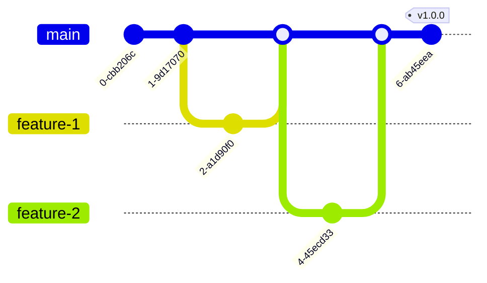

## Version Control with Git

Version control is fundamental to modern software development. Git enables collaboration, tracking changes, and maintaining code history.

## Git Workflow Strategies

### Gitflow


**Branch Structure:**
- `main`: Production-ready code
- `develop`: Integration branch
- `feature/*`: New features
- `release/*`: Release preparation
- `hotfix/*`: Production fixes

### Trunk-Based Development



**Characteristics:**
- Short-lived branches
- Frequent integration to main
- Feature flags for incomplete work
- Rapid deployment

### GitHub Flow


**Process:**
1. Create branch from `main`
2. Add commits
3. Open Pull Request
4. Review and discuss
5. Deploy and test
6. Merge to `main`

## Branch Naming Conventions

```bash
# Features
feature/user-authentication
feature/payment-integration

# Bug fixes
bugfix/login-error
fix/memory-leak

# Hotfixes
hotfix/security-patch
hotfix/critical-bug

# Releases
release/v1.2.0
release/2024-01-sprint

# Experiments
experiment/new-algorithm
spike/performance-test
```

## Commit Messages

### Conventional Commits

```bash
# Format
<type>[optional scope]: <description>

[optional body]

[optional footer(s)]
```

**Types:**
- `feat`: New feature
- `fix`: Bug fix
- `docs`: Documentation
- `style`: Formatting
- `refactor`: Code restructuring
- `test`: Adding tests
- `chore`: Maintenance

**Examples:**

```bash
# Feature
git commit -m "feat(auth): add OAuth2 authentication"

# Bug fix
git commit -m "fix(api): resolve null pointer exception in user endpoint"

# Breaking change
git commit -m "feat(api)!: change response format

BREAKING CHANGE: API now returns data in new format.
Clients must update to handle new structure."

# Multiple changes
git commit -m "feat(user): add profile picture upload

- Add file upload endpoint
- Implement image validation
- Add S3 storage integration

Closes #123"
```

### Commit Message Template

```bash
# .gitmessage
# <type>(<scope>): <subject>
# |<----  Using a Maximum Of 50 Characters  ---->|

# Explain why this change is being made
# |<----   Try To Limit Each Line to a Maximum Of 72 Characters   ---->|

# Provide links or keys to any relevant tickets, articles or other resources
# Example: Github issue #23

# --- COMMIT END ---
# Type can be
#    feat     (new feature)
#    fix      (bug fix)
#    refactor (refactoring code)
#    style    (formatting, missing semi colons, etc; no code change)
#    docs     (changes to documentation)
#    test     (adding or refactoring tests; no production code change)
#    chore    (updating build tasks etc; no production code change)
# --------------------
# Remember to
#   - Capitalize the subject line
#   - Use the imperative mood in the subject line
#   - Do not end the subject line with a period
#   - Separate subject from body with a blank line
#   - Use the body to explain what and why vs. how
#   - Can use multiple lines with "-" for bullet points in body
```

```bash
# Set as default
git config --global commit.template ~/.gitmessage
```

## Git Hooks

### Pre-commit Hook

```bash
#!/bin/sh
# .git/hooks/pre-commit

echo "Running pre-commit checks..."

# Run linter
npm run lint
if [ $? -ne 0 ]; then
    echo "❌ Linting failed. Please fix errors before committing."
    exit 1
fi

# Run tests
npm test
if [ $? -ne 0 ]; then
    echo "❌ Tests failed. Please fix tests before committing."
    exit 1
fi

# Check for sensitive data
if git diff --cached | grep -E '(API_KEY|PASSWORD|SECRET)'; then
    echo "❌ Potential sensitive data detected!"
    exit 1
fi

echo "✅ Pre-commit checks passed"
exit 0
```

### Commit-msg Hook

```bash
#!/bin/sh
# .git/hooks/commit-msg

commit_msg_file=$1
commit_msg=$(cat "$commit_msg_file")

# Check commit message format
if ! echo "$commit_msg" | grep -qE '^(feat|fix|docs|style|refactor|test|chore)(\(.+\))?: .{1,50}'; then
    echo "❌ Invalid commit message format"
    echo "Format: <type>(<scope>): <subject>"
    echo "Example: feat(auth): add login functionality"
    exit 1
fi

exit 0
```

### Pre-push Hook

```bash
#!/bin/sh
# .git/hooks/pre-push

echo "Running pre-push checks..."

# Run full test suite
npm run test:all
if [ $? -ne 0 ]; then
    echo "❌ Tests failed. Push aborted."
    exit 1
fi

# Check branch protection
protected_branch='main'
current_branch=$(git symbolic-ref HEAD | sed -e 's,.*/\(.*\),\1,')

if [ "$current_branch" = "$protected_branch" ]; then
    echo "❌ Direct push to $protected_branch is not allowed!"
    exit 1
fi

echo "✅ Pre-push checks passed"
exit 0
```

## Git Configuration

### Global Configuration

```bash
# User identity
git config --global user.name "Your Name"
git config --global user.email "your.email@example.com"

# Editor
git config --global core.editor "code --wait"

# Default branch name
git config --global init.defaultBranch main

# Line endings
git config --global core.autocrlf input  # Linux/Mac
git config --global core.autocrlf true   # Windows

# Colors
git config --global color.ui auto

# Aliases
git config --global alias.co checkout
git config --global alias.br branch
git config --global alias.ci commit
git config --global alias.st status
git config --global alias.unstage 'reset HEAD --'
git config --global alias.last 'log -1 HEAD'
git config --global alias.visual '!gitk'
```

### Repository Configuration

```ini
# .gitconfig (local)
[core]
    filemode = false
    autocrlf = input

[branch]
    autosetuprebase = always

[pull]
    rebase = true

[push]
    default = current

[alias]
    lg = log --graph --pretty=format:'%Cred%h%Creset -%C(yellow)%d%Creset %s %Cgreen(%cr) %C(bold blue)<%an>%Creset' --abbrev-commit
```

## Useful Git Commands

### Status and History

```bash
# Detailed status
git status -sb

# Show changes
git diff
git diff --staged
git diff main...feature-branch

# Pretty log
git log --oneline --graph --all --decorate

# Show file history
git log --follow -p -- file.txt

# Find when a bug was introduced
git bisect start
git bisect bad  # Current version is bad
git bisect good v1.0.0  # Last known good version
```

### Branching

```bash
# Create and switch
git checkout -b feature/new-feature

# Switch branches
git switch main
git switch -c feature/another-feature

# Delete branch
git branch -d feature-branch  # Safe delete
git branch -D feature-branch  # Force delete

# Rename branch
git branch -m old-name new-name

# List branches
git branch -a  # All branches
git branch -r  # Remote branches
```

### Staging and Committing

```bash
# Interactive staging
git add -p

# Stage all changes
git add -A

# Amend last commit
git commit --amend --no-edit
git commit --amend -m "New message"

# Unstage files
git restore --staged file.txt
git reset HEAD file.txt
```

### Undoing Changes

```bash
# Discard local changes
git restore file.txt
git checkout -- file.txt

# Undo last commit (keep changes)
git reset --soft HEAD~1

# Undo last commit (discard changes)
git reset --hard HEAD~1

# Revert a commit (create new commit)
git revert <commit-hash>

# Clean untracked files
git clean -fd  # Force delete files and directories
```

### Remote Operations

```bash
# Add remote
git remote add origin https://github.com/user/repo.git

# Push branch
git push -u origin feature-branch

# Fetch without merge
git fetch origin

# Pull with rebase
git pull --rebase origin main

# Delete remote branch
git push origin --delete feature-branch
```

### Stashing

```bash
# Save changes temporarily
git stash
git stash save "Work in progress"

# List stashes
git stash list

# Apply stash
git stash apply
git stash apply stash@\{0\}

# Apply and remove
git stash pop

# Clear all stashes
git stash clear
```

### Rebasing

```bash
# Rebase on main
git checkout feature-branch
git rebase main

# Interactive rebase (last 3 commits)
git rebase -i HEAD~3

# Continue after resolving conflicts
git rebase --continue

# Abort rebase
git rebase --abort
```

### Cherry-picking

```bash
# Apply specific commit
git cherry-pick <commit-hash>

# Cherry-pick range
git cherry-pick start-hash^..end-hash
```

## .gitignore Best Practices

```bash
# Dependencies
node_modules/
vendor/
venv/
__pycache__/

# Build outputs
dist/
build/
*.o
*.pyc
*.class

# IDE
.vscode/
.idea/
*.swp
*.swo
*~

# OS
.DS_Store
Thumbs.db

# Environment
.env
.env.local
.env.*.local

# Logs
*.log
logs/

# Temporary files
tmp/
temp/
*.tmp

# Secrets
*.key
*.pem
secrets/
credentials.json

# Test coverage
coverage/
.nyc_output/
htmlcov/
```

## Git Submodules

```bash
# Add submodule
git submodule add https://github.com/user/lib.git libs/lib

# Clone repo with submodules
git clone --recursive https://github.com/user/repo.git

# Initialize submodules
git submodule init
git submodule update

# Update all submodules
git submodule update --remote

# Remove submodule
git submodule deinit libs/lib
git rm libs/lib
```

## Advanced Git Techniques

### Git Worktrees

```bash
# Create worktree
git worktree add ../repo-feature feature-branch

# List worktrees
git worktree list

# Remove worktree
git worktree remove ../repo-feature
```

### Git Reflog

```bash
# Show reflog
git reflog

# Recover lost commit
git reset --hard HEAD@\\{2\\}

# Find lost branch
git reflog | grep branch-name
git checkout -b recovered-branch HEAD@\\{n\\}
```

### Git Blame

```bash
# Show who changed each line
git blame file.txt

# Ignore whitespace changes
git blame -w file.txt

# Show line range
git blame -L 10,20 file.txt
```

## Git Security

### Signed Commits

```bash
# Generate GPG key
gpg --gen-key

# List keys
gpg --list-secret-keys --keyid-format LONG

# Configure Git
git config --global user.signingkey <KEY_ID>
git config --global commit.gpgsign true

# Sign commit
git commit -S -m "Signed commit"

# Verify signature
git log --show-signature
```

### Credential Management

```bash
# Cache credentials (15 min)
git config --global credential.helper cache

# Cache for custom time (1 hour)
git config --global credential.helper 'cache --timeout=3600'

# Store permanently (use with caution)
git config --global credential.helper store

# macOS Keychain
git config --global credential.helper osxkeychain

# Windows Credential Manager
git config --global credential.helper wincred
```

## Git Best Practices

<Steps>
  <Step>**Commit Often**: Small, focused commits</Step>
  <Step>**Write Clear Messages**: Follow conventions</Step>
  <Step>**Review Before Push**: Check what you're sharing</Step>
  <Step>**Pull Before Push**: Stay up to date</Step>
  <Step>**Branch for Features**: Isolate changes</Step>
  <Step>**Never Commit Secrets**: Use .gitignore</Step>
  <Step>**Use Tags**: Mark releases and milestones</Step>
  <Step>**Sign Commits**: Verify authenticity</Step>
</Steps>

## Next Steps

<Cards>
  <Card title="Code Review" href="/docs/dev/code-review" />
  <Card title="CI/CD" href="/docs/cicd" />
  <Card title="GitHub Actions" href="/docs/cicd/github-actions" />
</Cards>
