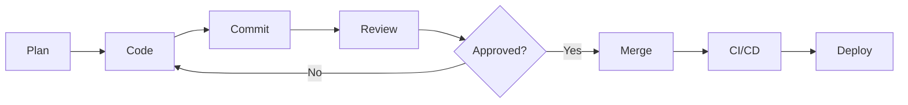

## Development in DevSecOps

Modern development practices emphasize automation, testing, code quality, and collaboration.

## Development Areas

<Cards>
  <Card title="Code Quality" href="/docs/dev/code-quality" icon="Star" />
  <Card title="Testing" href="/docs/dev/testing" icon="TestTube" />
  <Card title="Version Control" href="/docs/dev/version-control" icon="GitBranch" />
  <Card title="Code Review" href="/docs/dev/code-review" icon="Eye" />
</Cards>

## Development Workflow

## Modern Development Practices

### 1. Test-Driven Development (TDD)

Write tests before code to ensure functionality and prevent regressions.

### 2. Continuous Integration

Automatically build and test code changes to catch issues early.

### 3. Code Reviews

Peer review all changes to improve quality and share knowledge.

### 4. Automated Testing

Comprehensive test suites run automatically on every change.

### 5. Infrastructure as Code

Manage infrastructure through version-controlled code.

## Getting Started

Begin with [Code Quality](/docs/dev/code-quality) to establish standards, then implement [Testing](/docs/dev/testing) practices.

## Development Tools

| Category | Tools |
|----------|-------|
| **IDEs** | VS Code, IntelliJ, PyCharm |
| **Version Control** | Git, GitHub, GitLab |
| **Testing** | Jest, PyTest, JUnit |
| **Quality** | ESLint, SonarQube, Black |
| **Debugging** | Chrome DevTools, pdb, GDB |
