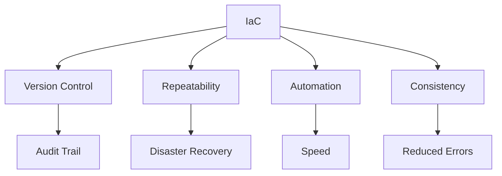

## Infrastructure in DevSecOps

Modern infrastructure is managed as code, containerized, and orchestrated at scale.

## Infrastructure Areas

<Cards>
  <Card title="Docker" href="/docs/infrastructure/docker" icon="Container" />
  <Card title="Kubernetes" href="/docs/infrastructure/kubernetes" icon="Cube" />
  <Card title="Infrastructure as Code" href="/docs/infrastructure/iac" icon="FileCode" />
  <Card title="Kubernetes Security" href="/docs/infrastructure/kubernetes-security" icon="Shield" />
</Cards>

## Infrastructure as Code Benefits

## Cloud Platforms

| Platform | Strengths | Best For |
|----------|-----------|----------|
| **AWS** | Comprehensive services | Enterprise, variety |
| **Azure** | Microsoft integration | Enterprise, Windows |
| **GCP** | AI/ML, Kubernetes | Data science, startups |
| **DigitalOcean** | Simplicity | Small projects |

## Getting Started

Begin with [Docker](/docs/infrastructure/docker) to containerize applications, then scale with [Kubernetes](/docs/infrastructure/kubernetes).
